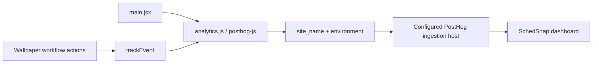

# SchedSnap PostHog Implementation

## Entry Point and SDK Lifecycle

[main.jsx](../../src/main.jsx) imports [analytics.js](../../src/lib/analytics.js) before rendering the React application. Initialization runs at module load, outside React components, so React StrictMode does not initialize another client on each effect replay.

`analytics.js` reads `VITE_POSTHOG_TOKEN` and `VITE_POSTHOG_HOST`. A missing token skips initialization. The host falls back to `https://us.i.posthog.com`. SDK initialization and custom capture calls are wrapped in error handling so tracking failures do not interrupt the wallpaper creator.

| Configuration | Current behavior |
| --- | --- |
| `capture_pageview: 'history_change'` | Initial pageviews and SPA pathname navigation |
| `person_profiles: 'identified_only'` | Anonymous events; the app does not call `identify()` |
| `disable_session_recording: true` | No session replay |
| `mask_all_text: true` | Autocapture omits DOM text |
| `mask_all_element_attributes: true` | Autocapture omits element attributes |
| `loaded` callback | Registers `site_name` and `environment` as shared event properties |
| `before_send` callback | Applies those tags to SDK events, including automatic events |

`environment` comes from `import.meta.env.MODE`, with `development` as the fallback. Custom Vite modes therefore use their own mode name, rather than always being tagged `production`.

## Data Flow

Automatic events use the SDK directly. UI handlers call `trackEvent(event, properties)`, which skips capture if analytics is disabled or the visitor has opted out. Delivery uses the browser SDK; this application has no PostHog server-side endpoint or backend analytics SDK.

`templateProperties(template)` returns only the design's `template_id` and `collection`. It defaults a missing collection to `original`; it does not serialize the full template or schedule.

## Source Map

| Source | Responsibility |
| --- | --- |
| [src/lib/analytics.js](../../src/lib/analytics.js) | Initialization, common tags, safe capture wrapper, template metadata |
| [src/main.jsx](../../src/main.jsx) | Loads analytics before rendering |
| [Hero.jsx](../../src/components/Hero.jsx) | Hero Create wallpaper and Explore actions |
| [Navbar.jsx](../../src/components/Navbar.jsx) | Navbar Create wallpaper action |
| [DesignShowcase.jsx](../../src/components/DesignShowcase.jsx) | Collection-specific Create wallpaper action |
| [TemplateGallery.jsx](../../src/pages/ScheduleWallpaper/TemplateGallery.jsx) | Collection filters and design preview opening |
| [Index.jsx](../../src/pages/ScheduleWallpaper/Index.jsx) | Step views, design selection, import outcomes, sample source, appearance events |
| [Uploader.jsx](../../src/pages/ScheduleWallpaper/Uploader.jsx) | Image preparation starts, success, and failure |
| [TemplateWorkspace.jsx](../../src/pages/ScheduleWallpaper/TemplateWorkspace.jsx) | Manual entry, enlarged preview, PNG rendering and download initiation |
| [downloadBlob.js](../../src/utils/downloadBlob.js) | Standard download link and in-app-browser new-tab fallback |

## Workflow Semantics

The creator maintains `scheduleSource` in React state: `manual`, `image`, `sample`, or `unknown`. Successful extraction sets `image`; sample loading sets `sample`; Enter manually sets `manual`; cancelling manual entry resets it to `unknown`. Subsequent class edits retain the original source.

Step tracking remembers the last `step:templateId` key in a ref. It prevents duplicates caused by StrictMode effect replay, class-count changes, or appearance edits on the same step. Returning to another step and then back records another step view. This deduplication lasts for the current mounted creator; reloading or reopening it starts a new view.

The classes-to-preview transition uses a query parameter. Its custom `wallpaper_step_viewed` and `schedule_previewed` events capture the transition even when pathname-based pageviews do not change.

Image preparation and AI import are separate actions. A successfully prepared upload does not mean extraction succeeded. Import success is recorded only after the API response passes the shared schedule schema. Failure events use controlled error categories and HTTP status, without sending raw messages or responses. Aborting an in-flight import produces a cancellation event.

Downloads have separate requested, started, failed, and repeated events. Rendering must produce a PNG before `wallpaper_download_started` is emitted. The browser can still block saving or a fallback new tab, so this event does not establish a completed save.

## Data and Privacy

Custom events include counts, file type/size, template IDs, controlled categories, setting names, timings, and output dimensions. They omit subjects, course codes, rooms, class times, schedule titles, filenames, uploaded image bytes, and generated wallpaper data. Appearance events record the setting name, not its entered value.

SDK events still contain standard browser/session properties, URLs, and referrer information. Autocapture masks DOM text and attributes. Anonymous identifiers can persist through SDK-managed browser storage, but this app does not identify an account or store schedule content in PostHog.

GeoIP enrichment happens in PostHog and can add approximate country, city, and region properties. No browser GPS reading or location-sharing event is implemented in this application.

## Event Reference

All events include `site_name` and `environment`, plus standard PostHog browser/session/referrer properties. Template events include `template_id` and `collection` where indicated below.

| Event | When | Custom properties |
| --- | --- | --- |
| `$pageview` | Initial load and pathname navigation | Standard SDK URL, browser, session and referrer properties |
| `$autocapture` | Clicks and supported DOM interactions, if enabled in the project | Masked DOM structure |
| `wallpaper_creation_started` | Hero, navbar or collection Create wallpaper click | `source`, optional `collection` |
| `designs_explored` | Hero Explore click | `source` |
| `wallpaper_step_viewed` | Creator enters design, classes or preview | `step`, optional template properties, `schedule_source`, `class_count` |
| `collection_filtered` | Gallery filter changes | `collection` |
| `template_previewed` | Gallery design preview opens | Template properties |
| `template_selected` | Use this design click | Template properties |
| `manual_schedule_started` | Enter manually click | Template properties |
| `sample_schedule_loaded` | Try a sample click | Template properties |
| `schedule_upload_started` | Image preparation starts | `file_type`, `file_size_bytes` |
| `schedule_upload_succeeded` | Image is ready for import | `file_type`, `file_size_bytes` |
| `schedule_upload_failed` | Image preparation fails | File metadata, `error_type` |
| `schedule_import_started` | Import classes request starts | Template properties |
| `schedule_import_succeeded` | Validated extraction is accepted | Template properties, `class_count`, `warning_count`, `duration_ms` |
| `schedule_import_failed` | API/network/validation failure | Template properties, `http_status`, `error_type`, `duration_ms` |
| `schedule_import_cancelled` | An in-flight import is aborted | Template properties |
| `schedule_previewed` | Creator enters preview | Template properties, `step`, `schedule_source`, `class_count` |
| `wallpaper_preview_enlarged` | Wallpaper viewer opens | Template properties |
| `wallpaper_appearance_changed` | Appearance control changes | Template properties, `setting` (no entered values) |
| `wallpaper_appearance_reset` | Appearance resets | Template properties |
| `wallpaper_download_requested` | Enabled Download wallpaper click | Template properties, `schedule_source`, `class_count`, `width`, `height` |
| `wallpaper_download_started` | PNG is rendered and browser download/open is requested | Download properties, `download_method`, `duration_ms` |
| `wallpaper_download_failed` | Rendering or download initiation throws | Download properties, `stage` |
| `wallpaper_download_repeated` | Save PNG again link click | Template properties, `schedule_source` |

`schedule_source` is `manual`, `image`, `sample`, or `unknown`. Edits retain the source used to create the schedule. Step views are deduplicated against React StrictMode and changes to the current step's form state; returning to a step records a new view. SPA pageviews track pathname changes; the custom step events cover the query-based transition from classes to preview.

`wallpaper_download_started` means the browser was asked to download/open a generated PNG. It does not prove that the user saved it to disk or set it as their wallpaper. `download_method` is `download_link` or `new_tab` for the in-app-browser fallback. The repeat link has its own event and should not inflate first-download totals. `duration_ms` is measured in milliseconds. Color inputs may generate multiple appearance-change events while dragging.

## Dashboard

Use [DASHBOARD.md](DASHBOARD.md) for metrics and the dashboard prompt. All production insights should filter the event properties `site_name = schedsnap` and `environment = production`.
